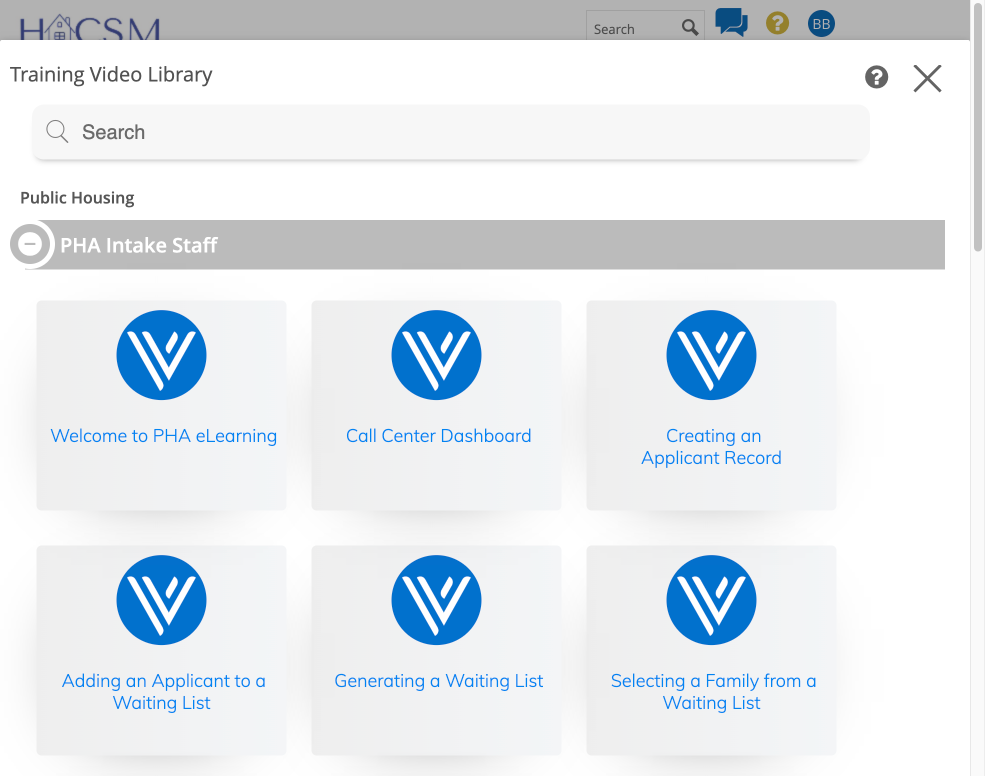
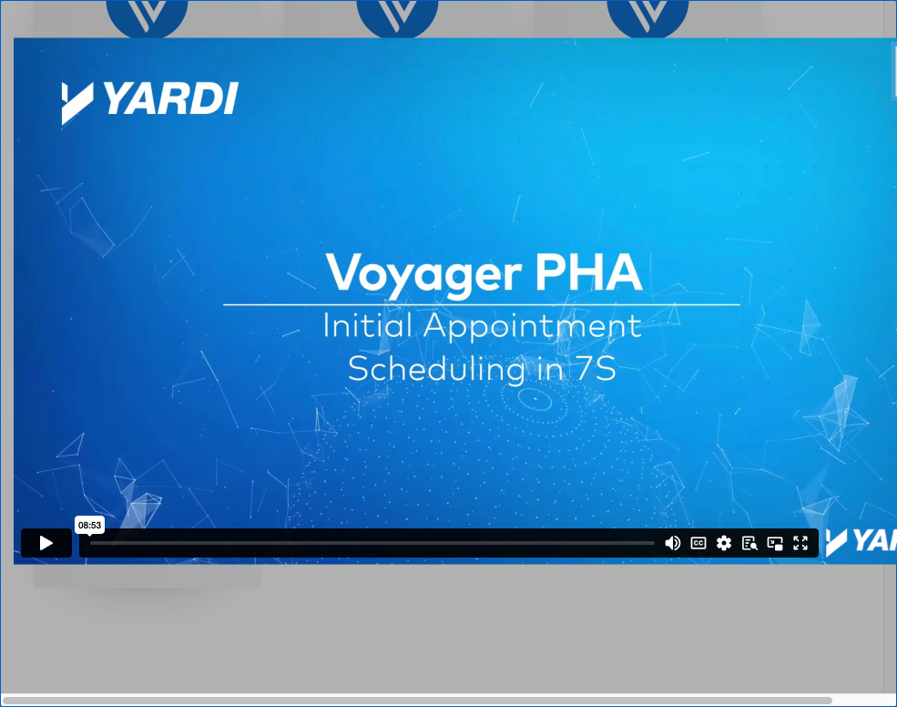
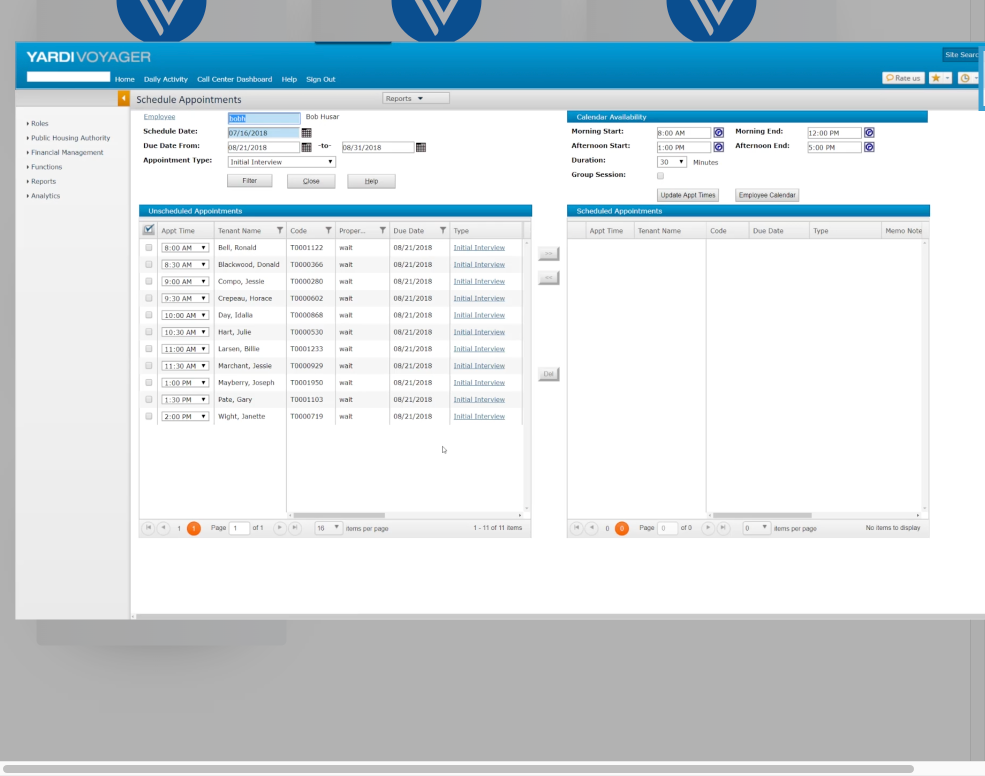

# HACSM Training Video Capture & Customization Tool

A Python tool that captures step-by-step screenshots from Yardi Aspire training videos and generates HACSM-specific training documentation. Designed for the Housing Authority of the County of San Mateo (HACSM) to create customized training guides from Yardi Voyager video tutorials.

## Screenshots

### Training Video Library
The tool connects to the Yardi Aspire Training Video Library and scans for all available training videos:



### Sample Captured Step
During capture, the tool takes screenshots at regular intervals as the video plays, capturing each step of the process:





## Why This Tool?

Yardi Aspire provides training videos, but HACSM's internal processes may differ from the generic Yardi workflow. This tool allows you to:

- **Capture** screenshots at regular intervals from training videos
- - **Review** each captured step interactively
  - - **Customize** steps: modify descriptions, insert HACSM-specific steps, mark process divergences
    - - **Publish** polished training guides in Markdown, HTML, and JSON formats with HACSM branding
     
      - ## Requirements
     
      - - Python 3.8+
        - - Google Chrome (or another supported browser)
          - - A valid Yardi Aspire login (videos are locked behind authentication)
           
            - ```bash
              pip install -r requirements.txt
              ```

              ## Supported Browsers

              The tool supports multiple browsers including AI-style browsers:

              | Browser     | macOS | Windows | Linux |
              |-------------|-------|---------|-------|
              | Chrome      | Yes   | Yes     | Yes   |
              | Brave       | Yes   | Yes     | Yes   |
              | Edge        | Yes   | Yes     | Yes   |
              | Firefox     | Yes   | Yes     | Yes   |
              | Arc         | Yes   | -       | -     |
              | Chromium    | Yes   | Yes     | Yes   |
              | Perplexity  | Yes   | -       | -     |
              | Custom path | Yes   | Yes     | Yes   |

              Check what's installed on your system:
              ```bash
              python video_capture_tool.py browsers
              ```

              ## Quick Start

              ### 1. List Available Videos
              ```bash
              python video_capture_tool.py list --url https://smcgov.yardiaspire.com/Dashboard
              ```
              The browser opens, you log in manually, then press ENTER. The tool scans for all training videos.

              ### 2. Capture a Specific Video
              ```bash
              python video_capture_tool.py capture \
                --url https://smcgov.yardiaspire.com/Dashboard \
                --video-title "Initial Appointment Scheduling" \
                --browser chrome
              ```

              ### 3. Capture All Videos
              ```bash
              python video_capture_tool.py capture \
                --url https://smcgov.yardiaspire.com/Dashboard \
                --all
              ```

              ### 4. Review Captured Steps
              ```bash
              python video_capture_tool.py review --project ./hacsm_training_captures/my_project
              ```
              Walk through each step and mark as: **(k)eep, (m)odify, (r)emove, (d)iverge, or (s)kip**.

              ### 5. Customize Steps

              Insert a custom HACSM-only step:
              ```bash
              python video_capture_tool.py customize --project ./my_project insert \
                --step 3 --description "Open HACSM internal checklist before proceeding"
              ```

              Mark a step where HACSM process differs:
              ```bash
              python video_capture_tool.py customize --project ./my_project diverge \
                --step 5 \
                --yardi-shows "Select default waitlist" \
                --hacsm-does "Select HACSM Priority Pool instead"
              ```

              Check project status:
              ```bash
              python video_capture_tool.py customize --project ./my_project status
              ```

              ### 6. Publish Training Guide
              ```bash
              python video_capture_tool.py publish --project ./my_project
              ```
              Generates Markdown, HTML (with HACSM branding), and JSON output in the `output/` folder.

              ## 4-Phase Workflow

              ```
              Phase 1: CAPTURE    -> Auto-capture screenshots from training videos
              Phase 2: REVIEW     -> Interactive review of each captured step
              Phase 3: CUSTOMIZE  -> Add/modify/remove/diverge steps for HACSM
              Phase 4: PUBLISH    -> Generate branded training documentation
              ```

              ## Project Structure

              Each capture creates a project directory:
              ```
              my_project/
                project.json          # Step data, metadata, phase tracking
                screenshots/          # Full-page captures
                  zoom/               # Zoomed detail captures
                custom_screenshots/   # Your custom screenshots
                output/               # Published guides (MD, HTML, JSON)
              ```

              ## Step Statuses

              | Status   | Meaning |
              |----------|---------|
              | draft    | Just captured, not yet reviewed |
              | keep     | Matches HACSM process, keep as-is |
              | modify   | Needs updated description or note |
              | remove   | Not relevant to HACSM workflow |
              | custom   | HACSM-only step (not in Yardi video) |
              | diverge  | Yardi shows X, but HACSM does Y |

              ## Options

              ```
              --browser <name>       Browser to use (chrome, brave, edge, firefox, arc, perplexity)
              --browser-path <path>  Custom browser binary path
              --headless             Run without GUI (for CI/automation)
              --interval <seconds>   Capture interval (default: 2.0s)
              --output <dir>         Custom output directory
              --format <type>        Publish format: all, markdown, html, json
              ```

              ## Important Notes

              - **Authentication Required**: Vimeo videos are locked behind Yardi Aspire authentication. The tool opens a browser window and waits for you to log in manually before capturing.
              - - **Browser Session**: The tool operates through a live authenticated browser session using Selenium WebDriver.
                - - **Internal Use**: Generated documentation is branded for HACSM internal use only.
                 
                  - ## License
                 
                  - Internal tool - HACSM use only.
